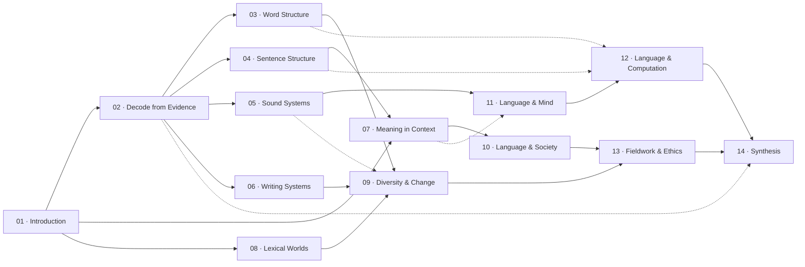

# LingoHub Interactive Learning Roadmap — Architecture and Build Instruction

Status: revision 3. This version keeps rigorous linguistics throughout while engineering an explicit path from zero prior knowledge into academic texts.

Companion curriculum: [LINGUISTICS-STUDY-ROADMAP.md](./LINGUISTICS-STUDY-ROADMAP.md)

## 1. Product thesis

LingoHub should not begin by asking a newcomer to choose among *phonology*, *morphology*, *syntax*, and *semantics*. Those categories are useful after the learner knows what questions they answer.

The roadmap should begin with an experience familiar enough to invite a prediction, then use that prediction to create a need for the academic idea.

```text
familiar phenomenon
→ learner predicts
→ the prediction partly fails
→ learner notices a pattern
→ academic term is introduced
→ formal explanation becomes useful
→ learner transfers the idea
→ authentic problem practice
```

The academic destination remains ambitious. The entrance changes.

## 2. Opening hook for a zero-basic learner

The first screen should not define linguistics. It should let the learner discover why linguistics is needed.

### Proposed opening

```text
One English word. Two ordinary Chinese translations.

brother → 哥哥 / 弟弟

Which translation is correct?
[哥哥] [弟弟] [Not enough context]
```

After the learner chooses, reveal two short contexts:

```text
My brother is three years older than I am. → 哥哥
My brother just started primary school.     → 弟弟
```

Then state:

> Translation is not replacing one label with another. English leaves age unstated here; Chinese usually makes it explicit. To translate, you must reconstruct meaning from words and context, then express the distinctions another language requires.

Only after this discovery introduce the first academic language:

> Linguists call this a difference in how languages **lexicalize** a semantic field. It belongs to **lexical semantics**, the study of how words organize meaning.

The learner can now choose:

- “Try another translation puzzle.”
- “How can words divide meaning differently?”
- “How can we decode a language we do not know?”
- “Show me the whole map.”

This hook establishes the roadmap’s central promise: familiar language contains hidden systems worth investigating.

## 3. Learning-ramp contract

Every entry lesson and every major submap must follow this sequence.

### Stage 1 — Hook

- Use a daily-language question, contradiction, image, sound, dialogue, or tiny dataset.
- Require no linguistic terminology.
- Make the learner want an explanation before offering one.

### Stage 2 — Try

- Ask for a prediction, match, grouping, segmentation, or choice that takes 30–90 seconds.
- Do not score the learner’s intuition as intelligence or ability.
- Preserve their answer so the reveal can respond to it.

### Stage 3 — Notice

- Highlight the smallest contrast that changes the answer.
- Ask the learner to articulate the pattern in ordinary language.
- Permit more than one tentative explanation when evidence is incomplete.

### Stage 4 — Name

- Introduce the academic term only after its function is visible.
- Pair it with a one-sentence plain definition and pronunciation where useful.
- Add the term to a persistent glossary.

### Stage 5 — Formalize

- Present the rigorous explanation, notation, table, rule, or structural representation.
- State assumptions and prerequisites explicitly.
- Connect the concept to adjacent academic fields.

### Stage 6 — Transfer

- Apply the idea to a second language or dataset whose surface features differ.
- Ask what remains invariant and what changes.
- Use this stage to prevent memorizing one example as the concept.

### Stage 7 — Practise

- Link a Start Here problem, then Practice and Challenge problems.
- Explain why each problem fits the concept.
- Return progress to the shared roadmap node.

The map card itself should show Stages 1–4. The full concept page contains Stages 4–7 and the academic reading.

## 4. Progressive reading depth

To help beginners reach later academic text, every concept page uses progressive disclosure rather than replacing technical material with summaries.

### Layer A — Orientation

- one hook question;
- one tiny interactive example;
- a 60–120 word plain-language reveal;
- “What you will be able to explain.”

### Layer B — Core lesson

- 500–1,200 words;
- definitions introduced in context;
- worked data and explicit reasoning;
- a common wrong turn;
- a transfer example and self-check.

### Layer C — Academic depth

- precise terminology and notation;
- competing analyses where relevant;
- interfaces with other subfields;
- source notes and recommended reading;
- hard LingoHub problems.

Layers are collapsible but not separate progress systems. A learner may open any layer. “Read deeper” should feel like continuing the same question, not leaving for a textbook written for someone else.

## 5. Two-layer information architecture

### Learner-facing layer

The main atlas is organized around questions:

- Why can the same idea need different words?
- How can I decode a language I have never learned?
- How can one word contain a whole sentence?
- How do languages show who did what?
- Why do speakers hear and organize sounds differently?
- How can marks carry language?
- Why can two correct translations still feel different?
- How do languages count, map space, and describe family?
- Why are languages different, related, and changing?
- Why do people speak differently in different situations?
- How do children and brains learn language?
- How can computers work with language?
- How can linguists learn from speakers responsibly?
- How do I solve a linguistics-olympiad problem?

### Academic layer

Underneath those questions is one canonical concept DAG containing phonetics, phonology, morphology, syntax, semantics, pragmatics, typology, historical linguistics, sociolinguistics, psycholinguistics, computational linguistics, field methods, and olympiad methods.

The academic layer provides rigor, stable slugs, prerequisites, glossary terms, lesson content, and problem mappings. A beginner is never required to know its classification labels before entering.

### Key rule

A submap is a **guided lens over shared concepts**, not an academic department and not a copied sequence of courses.

## 6. Interactive map experience

### 6.1 Atlas overview `/roadmap`

- The fourteen large sections appear first as one interconnected macro graph, not fourteen unrelated cards.
- **Section 01 · Introduction** is the shared entrance and is visually marked “Start here.”
- Every macro node displays its section number and stable section title; selecting it opens that section's divisible six-node submap.
- Solid edges show dominant learning routes and dashed edges show productive cross-connections. They recommend relationships without enforcing completion order.
- A searchable question-card index remains beneath the graph so learners may enter by an everyday question or academic term.
- Each card begins with one concrete example and repeats the same section number and title used by the macro node and submap heading.
- Selecting a section highlights its immediate macro relationships. Inside the submap, textual “Connected sections” controls preserve those same crossings.
- Academic field labels appear as smaller subtitles, for example:

```text
Section 03 · Word Structure
How can one word contain a whole sentence?
Morphology · Lexicon · Morphosyntax
```

- “Start here” launches the translation hook.
- “Explore all” opens the full atlas for experienced learners.

### 6.2 Submap `/roadmap/[submapSlug]`

- Pan, zoom, fit view, minimap, and reset.
- Nodes show learner-facing questions; a smaller badge gives the academic term.
- Selecting a node highlights immediate prerequisites and outcomes.
- “Show how I get here” highlights all upstream paths.
- “Where could this lead?” highlights downstream paths.
- Search works with ordinary words, academic terms, aliases, and Chinese/English names when localized.
- One-hop boundary nodes preserve connections to other submaps.
- Concepts reused across submaps share one lesson and progress state.

### 6.3 Concept preview

Selecting a node opens a side panel with:

- the hook and tiny Try interaction;
- the plain reveal;
- the academic term and definition;
- prerequisite explanations in ordinary language;
- progress and problem counts;
- “Continue to full lesson.”

### 6.4 Full lesson `/concepts/[conceptSlug]`

The full lesson follows the seven-stage learning-ramp contract and three reading layers. Academic content begins as soon as the learner has a reason to use it.

### 6.5 Personalization

- Modes: All, My Next Steps, In Progress, Mastered.
- No node is locked.
- Recommendations explain themselves.
- Completion remains visible to show accumulated structure.
- The learner can select a goal route without creating duplicate progress.

### 6.6 Mobile and accessibility

- Default to a tiered semantic list on narrow screens; graph view remains optional.
- Relationships, states, and academic labels must exist in text, not color alone.
- Preserve keyboard navigation, visible focus, screen-reader labels, and reduced motion.
- Do not run continuous decorative edge animations.

## 7. Submap architecture

The roadmap contains reusable submaps. One concept may belong to several submaps with a different beginner-facing frame.



Solid relationships summarize dominant routes; dashed relationships expose cross-field transfer. Neither type forces completion order.

## 8. Technology decision

Use `@xyflow/react` for the learner-facing graph. The interactive requirements justify it: pan, zoom, selection, minimap, controls, focus behavior, and keyboard support are built in.

```tsx
<ReactFlow
  nodes={nodes}
  edges={edges}
  nodeTypes={nodeTypes}
  fitView
  nodesDraggable={false}
  nodesConnectable={false}
  elementsSelectable
  nodesFocusable
  edgesFocusable
  autoPanOnNodeFocus
  minZoom={0.35}
  maxZoom={1.6}
>
  <MiniMap aria-label="Roadmap overview" />
  <Controls showInteractive={false} />
  <Background />
</ReactFlow>
```

The backend returns global and local tiers. `frontend/src/lib/roadmapLayout.ts` converts tier plus editorial order into deterministic positions. Adopt Dagre or ELK only if user testing reveals unacceptable crossings.

The semantic list is implemented independently; it must not be a screenshot or flattened canvas.

## 9. Data model

### 9.1 Containers and membership

- `Roadmap`: the whole learning atlas.
- `RoadmapSubmap`: a question-based guided lens.
- `SubmapConcept`: reusable membership plus learner-facing framing.
- `SubmapPrerequisite`: overview-level relationship between guided lenses.

### 9.2 Knowledge and learning

- `Concept`: canonical academic identity, staged lesson, and optional starter activity.
- `ConceptPrerequisite`: global prerequisite/helpful edge with a plain reason.
- `GlossaryTerm`: reusable plain and technical definitions.
- `ConceptGlossaryTerm`: records which lesson introduces or uses a term.
- `ProblemConcept`: precise link between a concept and an existing problem.
- `UserConceptProgress`: lesson interaction and cached transparent mastery.

## 10. Proposed Prisma additions

Use string values for editable vocabularies and validate them with Zod.

```prisma
model Roadmap {
  id        String   @id @default(cuid())
  slug      String   @unique @db.VarChar(100)
  title     String   @db.VarChar(160)
  summary   String   @db.VarChar(500)
  version   Int      @default(1)
  published Boolean  @default(false)
  createdAt DateTime @default(now())
  updatedAt DateTime @updatedAt
  submaps   RoadmapSubmap[]

  @@map("roadmaps")
}

model RoadmapSubmap {
  id           String  @id @default(cuid())
  roadmapId    String
  slug         String  @db.VarChar(100)
  question     String  @db.VarChar(220)
  academicArea String  @db.VarChar(180)
  summary      String  @db.VarChar(500)
  hook         String  @db.VarChar(500)
  icon         String? @db.VarChar(60)
  color        String? @db.VarChar(30)
  displayOrder Int     @default(0)
  published    Boolean @default(false)

  roadmap           Roadmap             @relation(fields: [roadmapId], references: [id], onDelete: Cascade)
  concepts          SubmapConcept[]
  prerequisiteLinks SubmapPrerequisite[] @relation("SubmapDependencies")
  dependentLinks    SubmapPrerequisite[] @relation("SubmapPrerequisites")

  @@unique([roadmapId, slug])
  @@index([roadmapId, displayOrder])
  @@map("roadmap_submaps")
}

model SubmapConcept {
  submapId       String
  conceptId      String
  role           String  @default("core") @db.VarChar(20)
  displayTitle   String? @db.VarChar(220)
  displaySummary String? @db.VarChar(400)
  displayOrder   Int     @default(0)

  submap  RoadmapSubmap @relation(fields: [submapId], references: [id], onDelete: Cascade)
  concept Concept       @relation(fields: [conceptId], references: [id], onDelete: Cascade)

  @@id([submapId, conceptId])
  @@index([conceptId])
  @@map("submap_concepts")
}

model SubmapPrerequisite {
  submapId             String
  prerequisiteSubmapId String
  kind                 String @default("helpful") @db.VarChar(20)
  reason               String @db.VarChar(300)

  submap             RoadmapSubmap @relation("SubmapDependencies", fields: [submapId], references: [id], onDelete: Cascade)
  prerequisiteSubmap RoadmapSubmap @relation("SubmapPrerequisites", fields: [prerequisiteSubmapId], references: [id], onDelete: Restrict)

  @@id([submapId, prerequisiteSubmapId])
  @@index([prerequisiteSubmapId])
  @@map("submap_prerequisites")
}

model Concept {
  id               String   @id @default(cuid())
  slug             String   @unique @db.VarChar(120)
  title            String   @db.VarChar(180) // academic name
  plainTitle       String   @db.VarChar(220)
  hookQuestion     String   @db.VarChar(300)
  plainReveal      String   @db.VarChar(900)
  academicSummary  String   @db.VarChar(600)
  domain           String   @db.VarChar(60)
  objectives       String[]
  starterActivity  Json?
  coreLesson       String   @db.Text
  academicDepth    String?  @db.Text
  estimatedMinutes Int      @default(15)
  masteryTarget    Int      @default(4)
  published        Boolean  @default(false)
  createdAt        DateTime @default(now())
  updatedAt        DateTime @updatedAt

  submaps           SubmapConcept[]
  prerequisiteLinks ConceptPrerequisite[] @relation("ConceptDependencies")
  dependentLinks    ConceptPrerequisite[] @relation("ConceptPrerequisites")
  glossaryTerms     ConceptGlossaryTerm[]
  problemLinks      ProblemConcept[]
  userProgress      UserConceptProgress[]

  @@index([domain, published])
  @@map("concepts")
}

model ConceptPrerequisite {
  conceptId      String
  prerequisiteId String
  kind           String @default("required") @db.VarChar(20)
  reason         String @db.VarChar(400) // plain-language learner explanation

  concept      Concept @relation("ConceptDependencies", fields: [conceptId], references: [id], onDelete: Cascade)
  prerequisite Concept @relation("ConceptPrerequisites", fields: [prerequisiteId], references: [id], onDelete: Restrict)

  @@id([conceptId, prerequisiteId])
  @@index([prerequisiteId])
  @@map("concept_prerequisites")
}

model GlossaryTerm {
  id                  String   @id @default(cuid())
  slug                String   @unique @db.VarChar(120)
  term                String   @db.VarChar(160)
  plainDefinition     String   @db.VarChar(500)
  technicalDefinition String?  @db.Text
  aliases             String[]
  conceptLinks        ConceptGlossaryTerm[]

  @@map("glossary_terms")
}

model ConceptGlossaryTerm {
  conceptId      String
  glossaryTermId String
  introducedHere Boolean @default(false)
  displayOrder   Int     @default(0)

  concept Concept      @relation(fields: [conceptId], references: [id], onDelete: Cascade)
  term    GlossaryTerm @relation(fields: [glossaryTermId], references: [id], onDelete: Cascade)

  @@id([conceptId, glossaryTermId])
  @@map("concept_glossary_terms")
}

model ProblemConcept {
  problemId    String
  conceptId    String
  role         String @default("practises") @db.VarChar(20)
  weight       Int    @default(1)
  reason       String @db.VarChar(300)
  displayOrder Int    @default(0)

  problem Problem @relation(fields: [problemId], references: [id], onDelete: Cascade)
  concept Concept @relation(fields: [conceptId], references: [id], onDelete: Cascade)

  @@id([problemId, conceptId])
  @@index([conceptId, role])
  @@map("problem_concepts")
}

model UserConceptProgress {
  userId            String
  conceptId         String
  status            String    @default("unseen") @db.VarChar(20)
  masteryScore      Int       @default(0)
  firstViewedAt     DateTime?
  lessonCompletedAt DateTime?
  lastCalculatedAt  DateTime  @default(now())
  updatedAt         DateTime  @updatedAt

  user    User    @relation(fields: [userId], references: [id], onDelete: Cascade)
  concept Concept @relation(fields: [conceptId], references: [id], onDelete: Cascade)

  @@id([userId, conceptId])
  @@index([userId, status])
  @@map("user_concept_progress")
}
```

Add `conceptProgress UserConceptProgress[]` to `User` and `concepts ProblemConcept[]` to `Problem`.

## 11. Starter-activity format

Keep the supported activity vocabulary small and validate every payload with a discriminated Zod union.

```ts
type StarterActivity =
  | {
      type: 'choice'
      prompt: string
      context?: string
      options: Array<{ id: string; label: string }>
      acceptedOptionIds: string[]
      reveal: string
    }
  | {
      type: 'matching'
      prompt: string
      left: Array<{ id: string; label: string }>
      right: Array<{ id: string; label: string }>
      pairs: Array<{ leftId: string; rightId: string }>
      reveal: string
    }
  | {
      type: 'grouping'
      prompt: string
      items: Array<{ id: string; label: string }>
      groups: Array<{ id: string; label: string }>
      assignments: Array<{ itemId: string; groupId: string }>
      reveal: string
    }
  | {
      type: 'prediction'
      prompt: string
      dataMarkdown: string
      revealAnswer: string
      reveal: string
    }
```

These are discovery interactions, not high-stakes assessment. A learner may reveal the explanation without submitting an answer.

## 12. Graph validation and projection

The backend must:

1. validate all roadmap, submap, concept, term, and problem references;
2. reject self-edges, duplicate edges, and cross-roadmap submap edges;
3. detect cycles in both submap and concept graphs with Kahn’s algorithm;
4. compute global tier by longest prerequisite path;
5. compute a normalized local tier for each submap projection;
6. return one-hop boundary nodes when requested;
7. use membership framing for cards while preserving canonical concept identity;
8. reject an entry node that lacks a hook, activity, plain reveal, and academic term;
9. reject undefined glossary terms or invalid activity payloads;
10. keep output deterministic using editorial order and title.

## 13. Progress and recommendation

Use the existing problem-solving record as evidence:

```text
earned evidence = sum(weight of each unique linked problem marked solved)
mastery score = min(100, floor(100 × earned evidence / concept.masteryTarget))
```

States:

- `unseen`: no lesson view and no linked activity;
- `exploring`: hook or lesson viewed, no linked problem started;
- `practising`: a linked problem started or solved, score below 100;
- `mastered`: score equals 100.

Completing a reading is visible but is not mastery. Recalculate progress on roadmap fetch so asynchronous LLM evaluations cannot leave stale state.

Recommendations prioritize concepts already begun, then concepts whose required prerequisites are mastered, then the selected goal route. Every recommendation includes a plain reason. Users may ignore it.

## 14. API

```text
GET /api/roadmaps
GET /api/roadmaps/:roadmapSlug
GET /api/roadmaps/:roadmapSlug/graph
GET /api/roadmaps/:roadmapSlug/graph?submap=:slug&includeBoundary=true
GET /api/concepts/:conceptSlug
GET /api/glossary/:termSlug
PATCH /api/concepts/:conceptId/progress
```

All reads use `optionalAuth`. The mutation infers the user from JWT.

Graph nodes return both frames:

```ts
interface RoadmapNode {
  id: string
  slug: string
  academicTitle: string
  displayTitle: string
  displaySummary: string
  hookQuestion: string
  domain: string
  tier: number
  globalTier: number
  submapSlugs: string[]
  boundary: boolean
  starterActivity?: StarterActivity
  introducedTerms: Array<{
    slug: string
    term: string
    plainDefinition: string
  }>
  progress?: ConceptProgress
}
```

The concept endpoint returns all three reading layers, prerequisites with reasons, glossary terms, downstream concepts, and problems grouped by role.

## 15. Frontend structure

```text
frontend/src/app/roadmap/page.tsx
frontend/src/app/roadmap/[submap]/page.tsx
frontend/src/app/concepts/[slug]/page.tsx
frontend/src/components/roadmap/RoadmapCanvas.tsx
frontend/src/components/roadmap/QuestionSubmapNode.tsx
frontend/src/components/roadmap/ConceptNode.tsx
frontend/src/components/roadmap/ConceptPreviewPanel.tsx
frontend/src/components/roadmap/StarterActivity.tsx
frontend/src/components/roadmap/ReadingDepth.tsx
frontend/src/components/roadmap/GlossaryTerm.tsx
frontend/src/components/roadmap/RoadmapToolbar.tsx
frontend/src/components/roadmap/RoadmapListView.tsx
frontend/src/components/roadmap/SubmapSwitcher.tsx
frontend/src/components/roadmap/ContinueLearning.tsx
frontend/src/hooks/useRoadmap.ts
frontend/src/lib/roadmapLayout.ts
```

Add Roadmap to the primary header. Keep selected concept, submap, view, and path mode in the URL; keep temporary viewport coordinates client-side.

## 16. Version-controlled content

```text
roadmap-data/linguistics-roadmap.v1.json
roadmap-data/lessons/<concept-slug>/core.md
roadmap-data/lessons/<concept-slug>/depth.md
backend/src/scripts/validateRoadmap.ts
backend/src/scripts/seedRoadmap.ts
```

JSON sections:

```json
{
  "schemaVersion": 3,
  "roadmap": {},
  "submaps": [],
  "submapEdges": [],
  "concepts": [],
  "memberships": [],
  "conceptEdges": [],
  "glossaryTerms": [],
  "conceptTerms": [],
  "problemLinks": []
}
```

Validate before writing. Seed transactionally and idempotently. Resolve problems by stable `Problem.number`. Archive explicitly with `published: false`; never delete production content merely because it disappeared from a draft file.

## 17. Implementation sequence

### Phase 1 — Opening journey

- Implement schema, validator, and seed pipeline.
- Build the bilingual `brother → 哥哥 / 弟弟` hook.
- Seed 8–12 concepts that move from translation to form/meaning/context, correspondence, segmentation, and a first unknown-language problem.
- Build the semantic list before the canvas.

Exit: a person with no linguistics background can complete the hook and explain why translation is not word replacement.

### Phase 2 — Interactive roadmap

- Add read APIs and `@xyflow/react`.
- Build question-based atlas, one submap, selection, path highlighting, search, pan, zoom, fit, minimap, and preview panel.
- Preserve the academic term as a visible secondary label.

Exit: the learner can travel from a familiar question to a formal concept and authentic problem without encountering unexplained prerequisite vocabulary.

### Phase 3 — Academic depth

- Add three-layer concept pages and glossary popovers.
- Implement transfer examples and grouped problems.
- Expand into word, sentence, sound, writing, and meaning routes.

Exit: academic-depth text is rigorous but every introduced term has an experiential or conceptual bridge.

### Phase 4 — Complete submaps and progress

- Encode the companion curriculum.
- Add remaining human, computational, fieldwork, and olympiad routes.
- Add personal progress, recommendations, and goal views.

Exit: shared concepts retain one progress state across every route.

### Phase 5 — Review

- Test with learners who have never studied linguistics, not only olympiad students.
- Ask each tester where they first felt lost and record the assumed concept.
- Review academic correctness with specialists and competition instructors.
- Review Chinese terminology and translation separately.

Exit: beginners can reach academic material and experts find that material accurate rather than diluted.

## 18. Required tests

- DAG validation, reference validation, and deterministic tiering.
- Starter-activity schema validation.
- Shared concept identity across submaps.
- Search by plain phrase, academic term, and alias.
- URL restoration of selected concept and path mode.
- Graph/list information equivalence.
- Keyboard and screen-reader navigation.
- Mobile list as default.
- No prerequisite access locks.
- Progress counts each solved problem once.
- Beginner usability: a tester can state the discovered idea before seeing its term.
- Academic continuity: every depth section declares and links its assumed concepts.

## 19. Acceptance criteria

- The first visible question makes sense without knowing what linguistics is.
- The opening includes a prediction and reveal, not a paragraph defining the field.
- Academic vocabulary is introduced after its referent is visible and remains present thereafter.
- Every major concept offers a route from hook to formalization to transfer to problem.
- Submaps are organized by learner questions while exposing their academic areas.
- Interactive pan, zoom, selection, search, and path highlighting work.
- Concepts reused across submaps share one lesson and progress state.
- The whole graph is acyclic, but no content is locked.
- A mobile semantic list contains the same relationships as the canvas.
- Existing problem, auth, submission, solution, and rating behavior remains unchanged.

## 20. Guardrails

- Do not open with academic subfield selection.
- Do not remove academic terminology; scaffold into it.
- Do not confuse a plain explanation with the complete lesson.
- Do not use childish mascots, fake praise, or lowered expectations to signal accessibility.
- Do not mark intuitive guesses as failures; use them to expose the missing distinction.
- Do not duplicate concepts when several routes use them.
- Do not infer prerequisites from broad tags.
- Do not calculate topology or mastery inside React components.
- Do not enable node dragging or edge editing for learners.
- Do not publish AI-generated lessons, examples, or edges without human review.
- Preserve unrelated local changes in `CLAUDE.md`, `frontend/package.json`, and `package-lock.json`.

## 21. Sources

- [MIT OpenCourseWare: 24.900 Introduction to Linguistics](https://ocw.mit.edu/courses/24-900-introduction-to-linguistics-spring-2022/download/)
- [Stanford Linguistics undergraduate major](https://linguistics.stanford.edu/degree-programs/undergraduate-programs/major-linguistics)
- [UCLA undergraduate linguistics courses](https://linguistics.ucla.edu/undergraduate-courses/)
- [University of Michigan fields of study](https://lsa.umich.edu/linguistics/fields-of-study.html)
- [WALS introduction and structural sections](https://wals.info/chapter/s1)
- [Language Science Press: Linguistics Olympiad: Training Guide](https://langsci-press.org/catalog/book/420)
- [International Linguistics Olympiad FAQ](https://ioling.org/faq/)
- [International Linguistics Olympiad sample problems](https://ioling.org/problems/samples/)
- [International Phonetic Association chart projects](https://www.internationalphoneticassociation.org/content/ipa-chart-projects)
- [React Flow](https://reactflow.dev/index)
- [React Flow accessibility](https://reactflow.dev/learn/advanced-use/accessibility)
